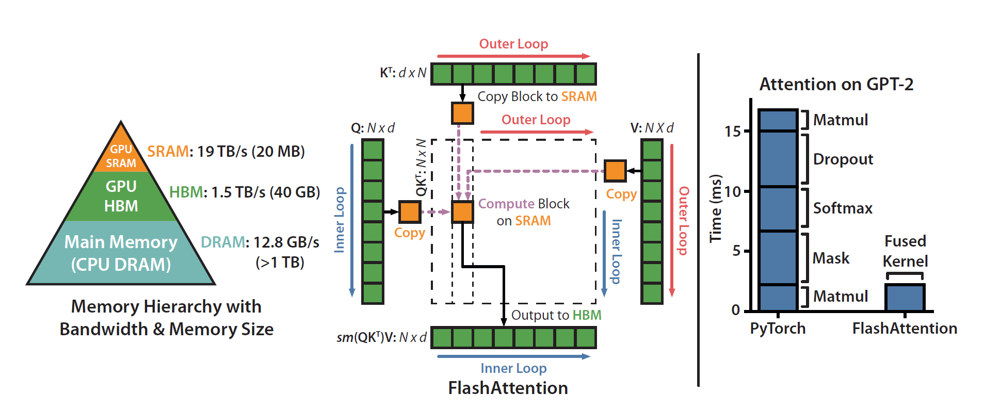

<p align="center">
    <a href="logo">
        
    </a>
</p>

<p align="center">
    <b>
        <font size="5">
            Triton Flash Attention
        </font>
    </b>
</p>


| Python Version | Build Status |
|---------------|-------------|
| 3.8          |  |
| 3.9          |  |
| 3.10         |  |
| 3.11         |  |
| 3.12         |  |
| 3.13         |  |


Coding Flash Attention from scratch using triton and pytorch.

## Setup environment
* Clone the repository and Go to `triton-flash-attn` directory.
```bash
git clone https://github.com/eljandoubi/triton-flash-attn.git && cd triton-flash-attn
```

* Build environment.
```bash
make build
```

## Clean environment
```bash
make clean
```
